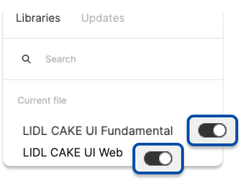

# Setup

CAKE UI Fundamental library is a rudimentary symbol library and has to be enabled first in Figma in order for all the other CAKE UI products to work (e.g. App, Chatbot, Web, Mail, … ).

---

## Figma

In order for you to be able to use the Fundamental library in your own Figma design file it has to be enabled first.

| Steps | Description | Preview |
|---|---|---|
| 1 | Open the top left Figma menu inside of a design file and choose "Libraries".  |  |
| 2 | Enable the library from the Figma “Assets” Panel (Shortcut Option + 3), search for the LIDL CAKE UI Fundamental library and enable it with the toggle switch. | |

### Download Figma library

LIDL CAKE UI Fundamental library is available on our github. Download it and publish it inside your Figma account. Enable the library in your working file to use it.

[Figma library - LIDL CAKE UI Fundamental](https://github.com/cake-hub/lidl-figma.git)
